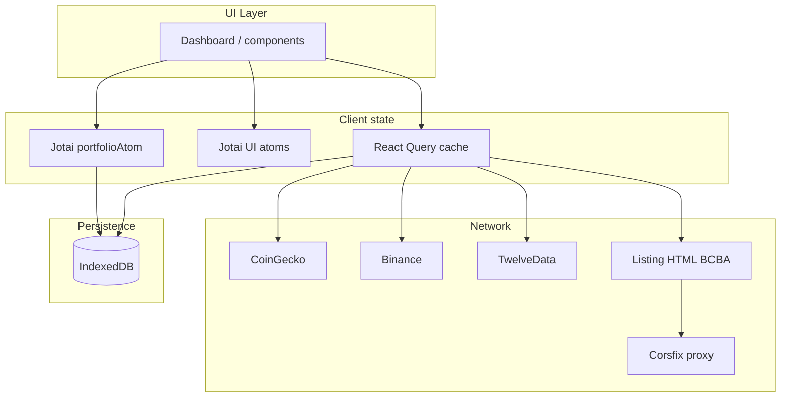

# Elliott — architecture

Elliott is a **client-side portfolio tracker**: holdings and preferences stay in the browser; market data is fetched from public HTTP sources (and optional third-party CORS proxies), then normalized into one model.

## High-level diagram



IndexedDB holds the portfolio document and **merged quote / FX snapshots** (`market-cache-db.ts`) so the UI can show last-known prices while refetching.

## State separation

| State type | Mechanism | Examples |
|------------|-----------|----------|
| **Portfolio** | Jotai + IndexedDB | Positions, quantities, avg cost, labels, exchange, fixed-income fields |
| **Market data** | React Query | Quotes, chart series; keyed and refetched on an interval |
| **UI** | Jotai (no persistence) | Selected chart symbol, chart horizon, dialog open/edit |

Portfolio mutations go through **pure helpers** in `src/lib/portfolio/mutations.ts` and `setPortfolio` on the atom. Persistence runs in `PortfolioPersistence` (debounced writes after hydration).

## Data pipeline (market)

1. **Raw fetch** — `src/lib/api/coingecko.ts`, `binance.ts`, `twelvedata.ts`, plus `src/lib/api/corsfix.ts` when a URL must be loaded cross-origin.
2. **Orchestration** — `src/lib/quotes/fetch-portfolio-quotes.ts`:
   - **Crypto**: Binance → CoinGecko fallback.
   - **Equity**: if `exchange === "BCBA"`, try **listing HTML** (`fetchBcbaListingHtmlQuote`) then **TwelveData**.
   - **Fixed income**: synthetic quote from user inputs (`build-fixed-income-quote.ts`).
3. **Normalization** — `src/lib/market-data/normalize.ts` builds `MarketData` (price, optional 24h %, source, `externalId` for charts when available). Listing HTML uses `normalizeFromListingHtmlQuote`.
4. **Addressing quotes** — `quoteKey` / `positionQuoteKey` in `src/lib/market-data/types.ts` keys the quote map; fixed income uses `fixed_income:${positionId}` so multiple deposits do not collide.

## React Query

- **Query key factory**: `src/lib/queries/keys.ts`.
- **Hooks**: `use-portfolio-quotes.ts`, `use-chart-series.ts`, `use-coingecko-exchange-rates.ts` (`"use client"`).
- **Hydration**: portfolio quotes can **seed** from `loadQuotesCache()` before the network returns.
- Policies: modest `staleTime`, interval refetch for live quotes, no aggressive `refetchOnWindowFocus` by default (see `AppProviders`).

## Calculations and rules

- **KPIs**: `src/lib/calculations/portfolio-kpis.ts` — totals, optional cost-basis PnL, value-weighted 24h estimate, allocation weights.
- **Fixed income accrual**: `src/lib/calculations/fixed-income-accrual.ts` — multiplier for synthetic `MarketData.price`.
- **Opportunities**: `src/lib/opportunities/rules.ts` — deterministic, explainable rules (concentration, 24h moves, book-level drawdown vs cost).

## UI composition

- **Shell**: `src/components/layout/app-shell.tsx` — app bar, primary actions.
- **Dashboard**: `src/components/dashboard/dashboard.tsx` — wires KPIs, table, allocation, opportunities, chart.
- **Charts**: TradingView **Lightweight Charts** in `src/components/charts/price-chart.tsx` (client-only chart lifecycle). BCBA history may use provider-specific series under `src/lib/providers/listing-html-bcba/`.

## Folder map

```
src/
  app/                 # Next.js routes, layout, global CSS
  components/          # Feature UI (dashboard, portfolio, charts, providers)
  lib/
    api/               # Raw HTTP clients (+ Corsfix helper)
    calculations/      # KPI math, fixed-income accrual
    format/            # Display helpers
    market-data/       # Types + normalizers
    opportunities/     # Alert rules
    portfolio/         # Position types + CRUD helpers
    providers/         # Swappable sources (e.g. BCBA listing HTML)
    queries/           # React Query hooks + keys
    quotes/            # Multi-source quote orchestration + fixed-income builder
    storage/           # IndexedDB (portfolio + market cache)
    utils/             # Small shared helpers
  state/               # Jotai atoms (portfolio vs UI)
  theme/               # MUI theme
```

## Extension points

- **New asset class**: extend `AssetKind`, add normalizer + fetch path in `fetch-portfolio-quotes.ts`, update UI labels — only if still within [constraints](./constraints.md).
- **New listing venue**: add a provider under `lib/providers/` and wire it in `fetchEquityQuote` (or equivalent) with a clear `exchange` convention.
- **New KPI**: add a pure function under `lib/calculations/` and consume in the dashboard.
- **New opportunity rule**: add a branch in `lib/opportunities/rules.ts` with a stable `id` for list keys.

## Related docs

- [Constraints](./constraints.md) — non-negotiable product and technical limits.
- [AGENTS.md](../AGENTS.md) — guidance for automated agents and contributors.
